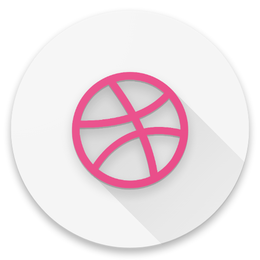

# Mango
[](https://travis-ci.org/TonnyL/Mango)

<div align="center">
	
</div>

Mango is an Android application for [Dribbble](https://dribbble.com/). Inspired by [Resplash](https://github.com/b-lam/Resplash), [Plaid](https://github.com/nickbutcher/plaid) and  [Protein](https://github.com/gejiaheng/Protein).

## Features
+ Kotlin and RxKotlin: Yes, fully written in Kotlin.
+ MVP architecture: Whole project is built on MVP architecture.
+ Material Design: Trying my best.
+ Deep link: Yes. Using [DeepLinkDispatch](https://github.com/airbnb/DeepLinkDispatch) from [Airbnb](https://github.com/airbnb).
+ App shortcuts: Supporting devices running Android 7.1+.
+ Usage of several awesome libraries: [Anko common](https://github.com/Kotlin/anko) for simplified intents, [Flexbox layout](https://github.com/google/flexbox-layout)  for smart and elegant layout, [Glide](https://github.com/bumptech/glide) for image loading, [Gson](https://github.com/google/gson) for serialization&deserialization, [Retrofit](https://github.com/square/retrofit) for HTTP requests, [Room](https://developer.android.com/topic/libraries/architecture/room.html) for data persistence.

## Screenshots

| Get Started     | Main     | Shot     |
| :-------------: | :-------------: | :-------------: |
|  |  |  |

| User     | Likes     | Comments     |
| :-------------: | :-------------: | :-------------: |
|  |  |  |

## Build
### Open the project in Android Studio
```
git clone https://github.com/TonnyL/Mango.git
```

Open the `Mango/` directory in Android Studio.

### Troubleshooting
+ Update the Android Studio to latest version.
+ Update the Kotlin to latest version.
+ Try to clean the project and rebuild it.
+ If none of the solutions above, file an issue or email me.

### Dribbble OAuth
The App client id, client secret and client access token are placed in [ApiConstants.kt](./app/src/main/java/io/github/tonnyl/mango/retrofit/ApiConstants.kt) file. But due to the [Rate Limiting](http://developer.dribbble.com/v1/#rate-limiting) and the possibility that Mango App may be available in Google Play (Check the [blueprints](https://github.com/TonnyL/Mango/wiki/Blueprints) for more details), if you want to continue the development, I suggest you register your own App at [Dribbble Developer Center](https://dribbble.com/account/applications/new) and modify the constants with your owns. **If the CLIENT SECRET and ACCESS TOKEN are abused, I will reset and not commit them to GitHub anymore!**

## Contributing
Discussions and pull requests are welcomed. The [GitHub Contributors Page](https://github.com/TonnyL/Mango/graphs/contributors) has an entry in the App.

## Translating

+ Chinese(Simplified) - [TonnyL](https://github.com/TonnyL)
+ German - [christopherkardas](https://github.com/christopherkardas)
+ Japanese - [jassica53](https://github.com/jassica53)
+ Korean - [prprpr](http://weibo.com/u/3883693517)
+ Vietnamese - [ldhnam](https://github.com/ldhnam)

## License
```
The MIT License (MIT)

Copyright (c) 2017 Lizhaotailang

Permission is hereby granted, free of charge, to any person obtaining a copy
of this software and associated documentation files (the "Software"), to deal
in the Software without restriction, including without limitation the rights
to use, copy, modify, merge, publish, distribute, sublicense, and/or sell
copies of the Software, and to permit persons to whom the Software is
furnished to do so, subject to the following conditions:

The above copyright notice and this permission notice shall be included in
all copies or substantial portions of the Software.

THE SOFTWARE IS PROVIDED "AS IS", WITHOUT WARRANTY OF ANY KIND, EXPRESS OR
IMPLIED, INCLUDING BUT NOT LIMITED TO THE WARRANTIES OF MERCHANTABILITY,
FITNESS FOR A PARTICULAR PURPOSE AND NONINFRINGEMENT. IN NO EVENT SHALL THE
AUTHORS OR COPYRIGHT HOLDERS BE LIABLE FOR ANY CLAIM, DAMAGES OR OTHER
LIABILITY, WHETHER IN AN ACTION OF CONTRACT, TORT OR OTHERWISE, ARISING FROM,
OUT OF OR IN CONNECTION WITH THE SOFTWARE OR THE USE OR OTHER DEALINGS IN
THE SOFTWARE.
```
