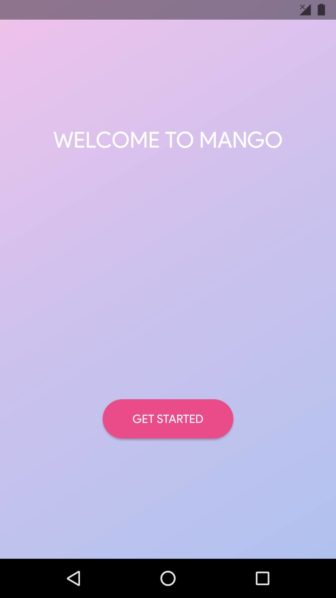
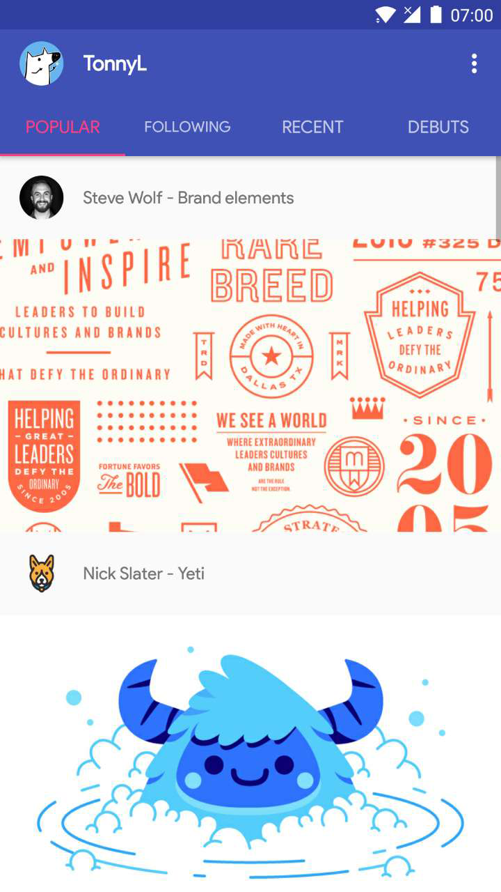
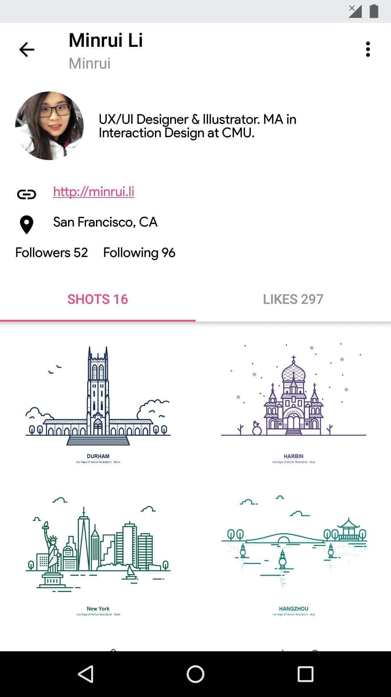
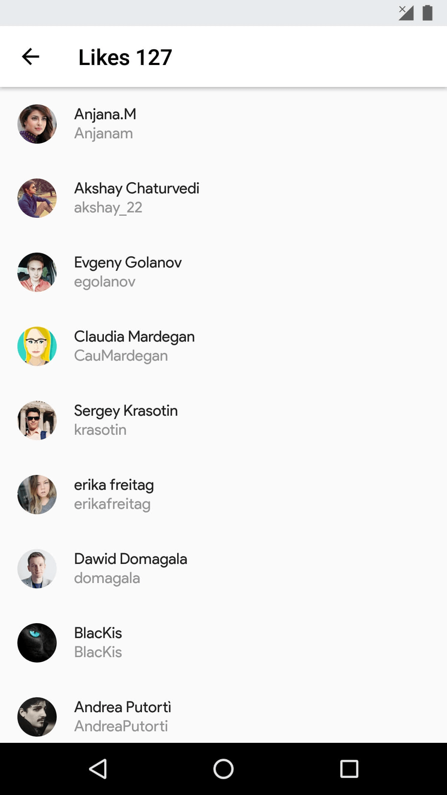
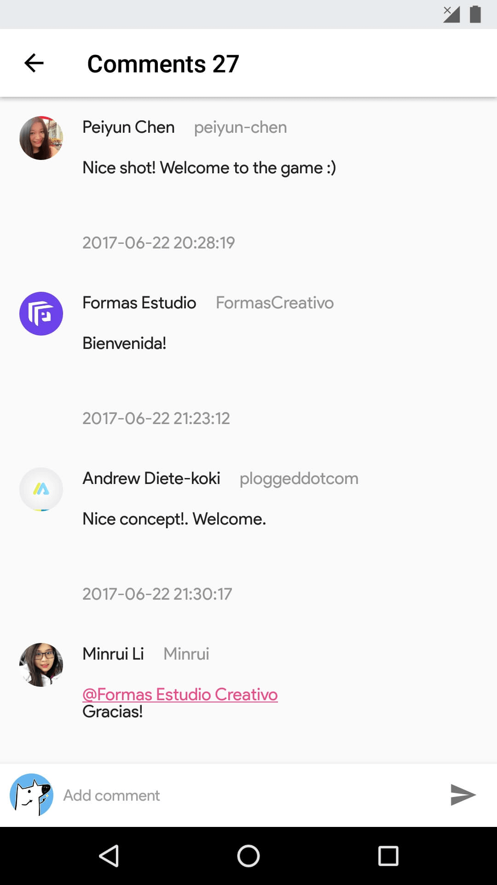

# Mango
[](https://travis-ci.org/TonnyL/Mango)

Mango is an Android application for [Dribbble](https://dribbble.com/). Inspired by [Resplash](https://github.com/b-lam/Resplash), [Plaid](https://github.com/nickbutcher/plaid) and  [Protein](https://github.com/gejiaheng/Protein).

## Features✨
+ Kotlin and RxKotlin: Yes, fully written in Kotlin.
+ MVP architecture: Whole project is built on MVP architecture.
+ Material Design: Trying my best.
+ Deep link: Yes. Using [DeepLinkDispatch](https://github.com/airbnb/DeepLinkDispatch) from [Airbnb](https://github.com/airbnb).
+ App shortcuts: Supporting devices running Android 7.1+.
+ Usage of several awesome libraries: [Anko common](https://github.com/Kotlin/anko) for simplified intents, [Flexbox layout](https://github.com/google/flexbox-layout)  for smart and elegant layout, [Glide](https://github.com/bumptech/glide) for image loading, [Gson](https://github.com/google/gson) for serialization&deserialization, [Retrofit](https://github.com/square/retrofit) for HTTP requests, [Room](https://developer.android.com/topic/libraries/architecture/room.html) for data persistence.

## Screenshots🖼

| Get Started     | Main     | Shot     |
| :-------------: | :-------------: | :-------------: |
|  |  |  |

| User     | Likes     | Comments     |
| :-------------: | :-------------: | :-------------: |
|  |  |  |

## Download🚀
[](https://play.google.com/store/apps/details?id=io.github.tonnyl.mango)

## Building⚒
### Open the Project in Android Studio
```
git clone https://github.com/TonnyL/Mango.git
```
Open the `Mango/` directory in Android Studio.

### Get Started
```shell
./gradlew assembleRelease
```

### Troubleshooting
+ Update the Android Studio to latest version.
+ Update the Kotlin to latest version.
+ Try to clean the project and rebuild it.
+ If none of the solutions above, file an issue or email me.

### Dribbble OAuth
You need to register your application at [Dribbble Developer Center](https://dribbble.com/account/applications/new). You can find information about how to gain access via the relevant links.

When you obtain the keys, you need to place them into the `mango.properties` file.

```java
CLIENT_ID=YOUR CLIENT ID
CLIENT_SECRET=YOUR CLIENT SECRET
VERIFICATION_TOKEN=YOUR VERIFICATION TOKEN
```
⚠️Notice: The `mango.properties` file is not committed to git, so you need to create it manually.

As for Callback URL, you need to define your own url and then modify relative constants in [ApiConstants.kt](./app/src/main/java/io/github/tonnyl/mango/retrofit/ApiConstants.kt).

## Contributing💪
Discussions and pull requests are welcomed. The [GitHub Contributors Page](https://github.com/TonnyL/Mango/graphs/contributors) has an entry in the App.

## Translating🌐

+ Chinese(Simplified) - [TonnyL](https://github.com/TonnyL)
+ German - [christopherkardas](https://github.com/christopherkardas)
+ Japanese - [jassica53](https://github.com/jassica53)
+ Korean - [prprpr](http://weibo.com/u/3883693517)
+ Vietnamese - [ldhnam](https://github.com/ldhnam)

## License📚
Mango is under an MIT license. See the [LICENSE](LICENSE) for more information.
